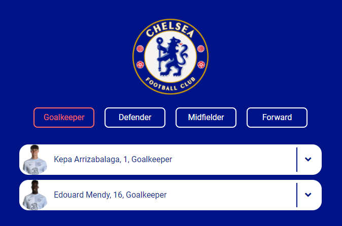

# Chelsea Players Lineup List mini Project
 

## 메인화면, RESULT

  

# 📑 프로젝트의 목적

1. HTML, CSS, JavaScript 를 이용해서 비슷하게 반복출력되고 있는 선수들 정보를 데이터만 받아와서 출력할 수 있는 구조 만들기
1. 포지션이 명시된 버튼을 클릭하면 해당하는 포지션의 선수들만 리스트에 보여지도록 하기
1. 반응성을 갖는 동적인 페이지로 포트폴리오 웹페이지를 구성하여 PC 와 태블릿, 모바일에 대응할 수 있도록 하기

 

# 📌 프로젝트에 사용한 기술들

- HTML, CSS, JavaScript
- webpack : npm 패키지들과 처리를 위해, 그리고 추가적인 프로젝트 확장이 가능하도록 webpack 을 사용해서 프로젝트를 제작
- Postcss : scss 등의 전처리를 위해 사용
- Babel : JavaScript 로 작성한 코드를 다양한 브라우저에서 이해할 수 있도록 변환시킴
- Scss : 표준CSS3 를 사용하면서 불필요하게 코드가 길어지는 것을 막고 효율적으로 스타일링을 하기 위해 사용

 

# 💾 구현사항

 

 

포지션 버튼을 클릭하면 버튼이 활성화되고, 해당 포지션의 선수들만 리스트에 나타남

 

 

오른쪽의 아이콘을 클릭하면 아래로 창이 열려 선수의 개인적인 정보를 추가로 볼 수 있음
 

# ✍ 느낀점, 감상

이전에 작업했던 쇼핑몰 미니 프로젝트를 진행하면서 바로 내가 좋아하는 첼시 선수들을 가지고 선수 포지션을 분류하는 미니 프로젝트를 진행해보면 좋겠다는 생각이 들었다. 
확실히 직접 낸 아이디어로 미니 프로젝트를 만들어보니 강사님과 진행한 코드를 따라하는 것 말고 직접 원하는 사항을 구현하면서 하니까 더욱 공부가 됐다. 
그리고 현재 내 실력으로는 이렇게 포지션을 분류하는 걸 만들어봤는데, 여기서 끊임없이 더 발전시켜 나갈 수 있다는 점에서 좋은 스타트가 되어준 미니 프로젝트였다.